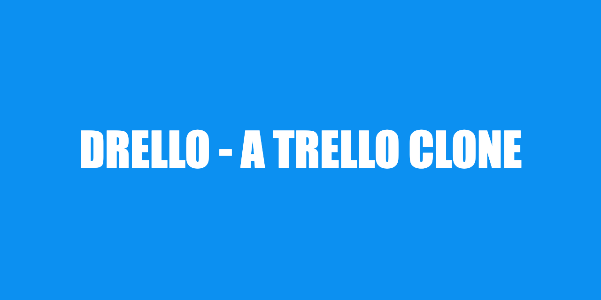

<div align="center">

  
  <h1>Awesome Readme Template</h1>
  
  <p>
    An awesome README template for your projects! 
  </p>
  
  
<!-- Badges -->
<p>
  <a href="https://github.com/Louis3797/awesome-readme-template/graphs/contributors">
    
  </a>
  <a href="">
    
  </a>
  <a href="https://github.com/Louis3797/awesome-readme-template/network/members">
    
  </a>
  <a href="https://github.com/Louis3797/awesome-readme-template/stargazers">
    
  </a>
  <a href="https://github.com/Louis3797/awesome-readme-template/issues/">
    
  </a>
  <a href="https://github.com/Louis3797/awesome-readme-template/blob/master/LICENSE">
    
  </a>
</p>
   
<h4>
    <a href="https://github.com/Louis3797/awesome-readme-template/">View Demo</a>
  <span> · </span>
    <a href="https://github.com/Louis3797/awesome-readme-template">Documentation</a>
  <span> · </span>
    <a href="https://github.com/Louis3797/awesome-readme-template/issues/">Report Bug</a>
  <span> · </span>
    <a href="https://github.com/Louis3797/awesome-readme-template/issues/">Request Feature</a>
  </h4>
</div>

<br />

# Project Title

Simple overview of use/purpose.

## Description

An in-depth paragraph about your project and overview of use.

## Getting Started

### Dependencies

* Describe any prerequisites, libraries, OS version, etc., needed before installing program.
* ex. Windows 10

### Installing

* How/where to download your program
* Any modifications needed to be made to files/folders

### Executing program

* How to run the program
* Step-by-step bullets
```
code blocks for commands
```

## Help

Any advise for common problems or issues.
```
command to run if program contains helper info
```

## Authors

Contributors names and contact info

ex. Dominique Pizzie  
ex. [@DomPizzie](https://twitter.com/dompizzie)

## Version History

* 0.2
    * Various bug fixes and optimizations
    * See [commit change]() or See [release history]()
* 0.1
    * Initial Release

## License

This project is licensed under the [NAME HERE] License - see the LICENSE.md file for details

## Acknowledgments

Inspiration, code snippets, etc.
* [awesome-readme](https://github.com/matiassingers/awesome-readme)
* [PurpleBooth](https://gist.github.com/PurpleBooth/109311bb0361f32d87a2)
* [dbader](https://github.com/dbader/readme-template)
* [zenorocha](https://gist.github.com/zenorocha/4526327)
* [fvcproductions](https://gist.github.com/fvcproductions/1bfc2d4aecb01a834b46)
