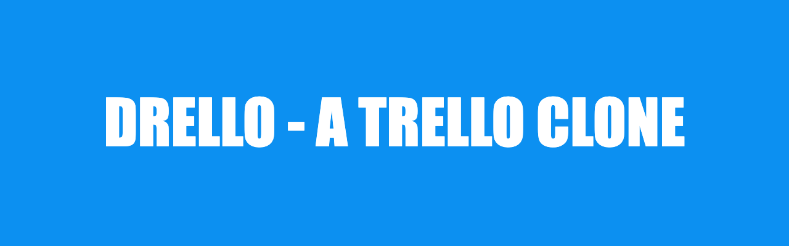

  
  <h1>DRELLO - A Trello Clone</h1>

# Android Application Project - *Drello*

## About the project

**Drello** is a simplified mobile version of a Trello Board with CRUD functionalities. 

## Features

- [x] User can sign up and sign in
- [x] User can create Boards, TaskLists, Lists, Cards
- [x] User can invite other users to the task list
- [x] User can change their personal information and avatar
- [x] User can customize and edit the task (change task image or colors)

## Notes

The app is not available on Google Play Store. Follow these steps to use the app:
- Install Android Studio
- Clone the project
- Run the project 
- Experience the app

## License

    Copyright [2022] [Duy Ngoc Huynh]

    Licensed under the Apache License, Version 2.0 (the "License");
    you may not use this file except in compliance with the License.
    You may obtain a copy of the License at

        http://www.apache.org/licenses/LICENSE-2.0

    Unless required by applicable law or agreed to in writing, software
    distributed under the License is distributed on an "AS IS" BASIS,
    WITHOUT WARRANTIES OR CONDITIONS OF ANY KIND, either express or implied.
    See the License for the specific language governing permissions and
    limitations under the License.

